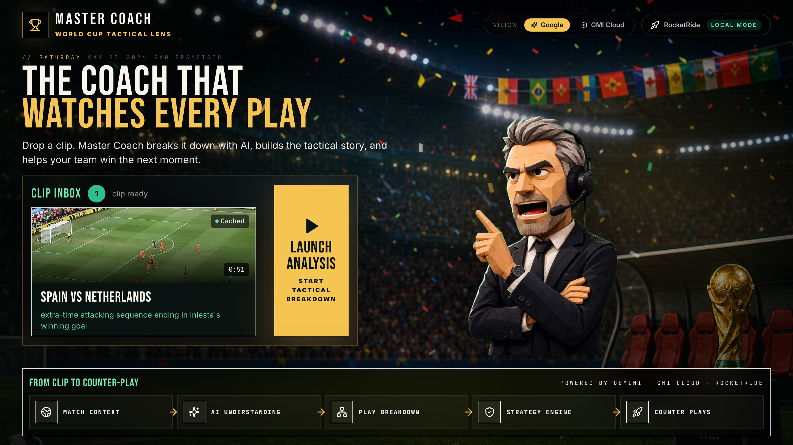
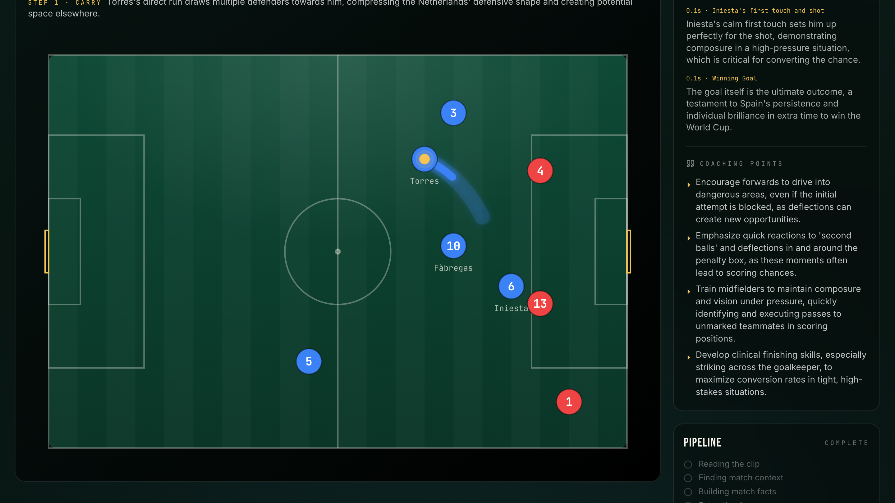
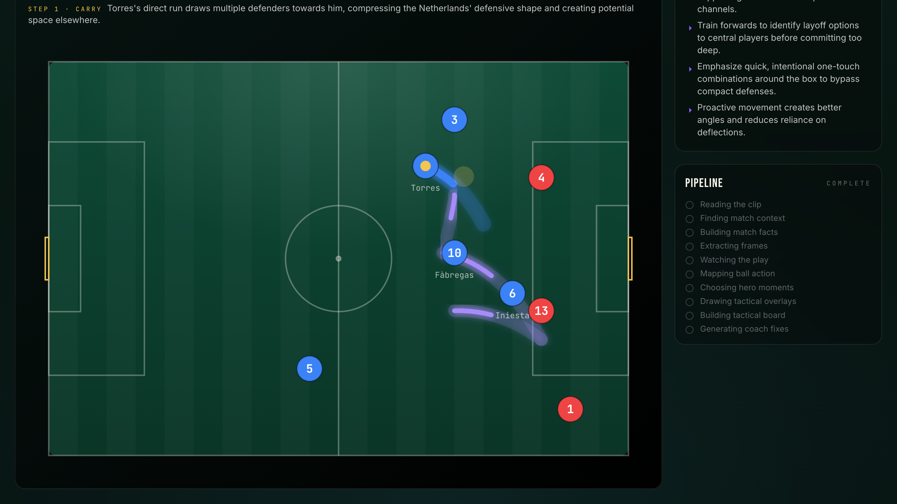
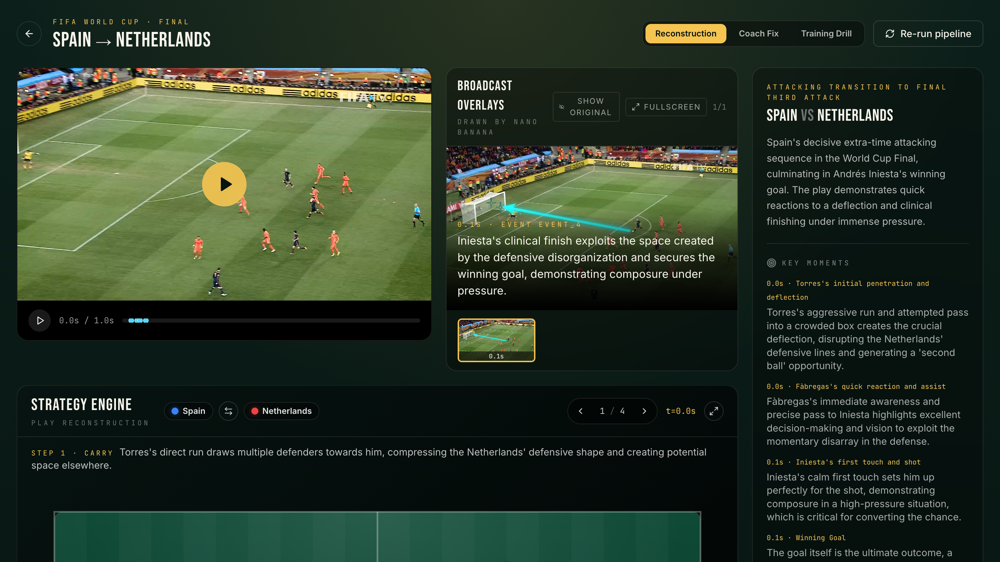
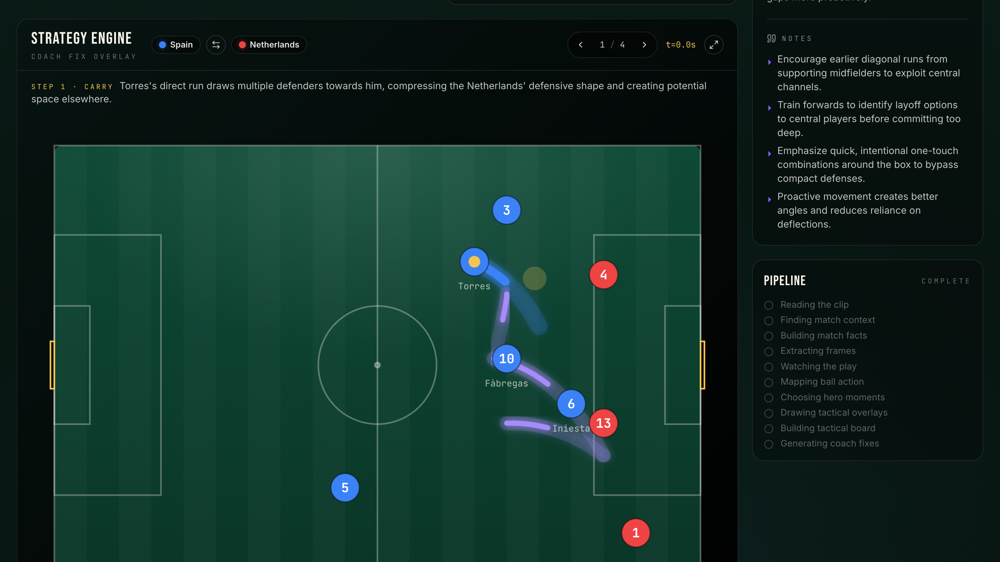
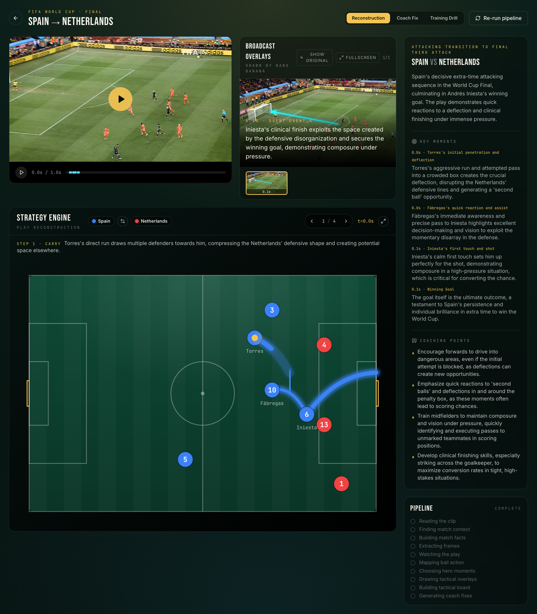

# Master Coach — World Cup Tactical Lens

> Drop a football clip into a folder. Master Coach watches it like an elite analyst, researches the match, and turns it into an animated tactical board with coach fixes.

Master Coach is a **local-first AI tactical studio for football coaches**. Point it at a video clip and it produces a synced video player, an animated 2D strategy board, broadcast-frame overlays drawn by Gemini Nano Banana, key-moment timelines, and corrective "coach fix" counter-plays — all from a single click.

Built for the GDG Newport Beach × RocketRide × GMI Cloud × NVIDIA hackathon.



---

## What it does

You drop an `.mp4` into `clips/inbox/`. The app picks it up, and on **Launch Analysis** it kicks off a 10-stage pipeline that:

1. Reads the clip and extracts frames with ffmpeg
2. Researches the match context on the web (Google Search grounding)
3. Builds a structured match-facts JSON (teams, lineups, numbers, goals)
4. Sends the clip into Gemini for full multimodal tactical understanding
5. Classifies every frame for key-moment density (Google or GMI Cloud)
6. Picks the best hero frames and asks Nano Banana to draw tactical arrows on them
7. Generates a normalized 2D strategy scene
8. Generates a coach-fix counter-play layer

The result is rendered in a synced three-pane analysis view.

## The Strategy Engine

A custom SVG pitch renders players as numbered chips, passes and runs as arrows, and space-creation as gold zones. It is keyframed against the video timeline so scrubbing the clip moves the board, and selecting an event jumps both.



Toggle **Coach Fix** mode and a second violet overlay drops in — corrective runs, alternate passing lanes, and the training drill that drills the pattern.



## Broadcast Overlays (Nano Banana)

For each hero moment, Gemini's `gemini-2.5-flash-image-preview` model paints cyan arrows, violet runs, and gold space-zones directly onto the broadcast frame. No green-screen, no manual annotation — just the real broadcast image with tactical overlays.



## Pipeline Rail

Every stage of the RocketRide workflow is visible live as it runs, so the demo never feels like a black box.



## Full analysis view



---

## Stack

| Layer | Tech |
|---|---|
| App | Next.js 15 (App Router), TypeScript, Tailwind |
| Tactical reasoning | Google Gemini `gemini-2.5-flash` (multimodal video) |
| Broadcast annotation | Gemini `gemini-2.5-flash-image-preview` (Nano Banana) |
| Frame classifier | GMI Cloud `Qwen2.5-VL-7B-Instruct` (OpenAI-compatible) — runtime toggle |
| Orchestration | RocketRide pipeline (`pipelines/master-coach-analysis.pipe`) |
| Video | ffmpeg / ffprobe |

The **VISION** toggle in the top-right of the landing page swaps the per-frame classifier between Google and GMI Cloud at runtime. Tactical reasoning, match facts, counterplay, and Nano Banana stay on Google.

---

## Quick start

```bash
npm install --legacy-peer-deps
npm run dev
```

Then drop a clip into `clips/inbox/`:

```text
clips/inbox/
  argentina-france-2022-108-messi-shot.mp4
  argentina-france-2022-108-messi-shot.meta.json   # optional sidecar
```

Open <http://localhost:3000>, pick the clip, hit **Launch Analysis**.

### Environment

Create `.env.local`:

```env
GOOGLE_API_KEY=...
GEMINI_TEXT_MODEL=gemini-2.5-flash
GEMINI_VIDEO_MODEL=gemini-2.5-flash
GEMINI_IMAGE_EDIT_MODEL=gemini-2.5-flash-image-preview

# Optional — leave GMI_API_KEY empty to lock the toggle to Google
GMI_API_KEY=
GMI_BASE_URL=https://api.gmi-serving.com/v1
GMI_VISION_MODEL=Qwen/Qwen2.5-VL-7B-Instruct
VISION_PROVIDER=google
```

You'll also need `ffmpeg` and `ffprobe` on your `PATH`.

### Optional sidecar metadata

If a clip is ambiguous, drop a `.meta.json` next to it to ground the pipeline:

```json
{
  "competition": "FIFA World Cup",
  "season": "2010",
  "match": "Spain vs Netherlands",
  "minute": "116",
  "team_focus": "Spain",
  "event": "Iniesta winning goal",
  "desired_mode": "improve_if_for_us"
}
```

---

## Pipeline stages

| # | Stage | Notes |
|---|---|---|
| 1 | `intake` | ffprobe for duration + basic media info |
| 2 | `extractFrames` | ffmpeg @ 4fps → `analysis/{clip}/frames/*.webp` |
| 3 | `matchContext` | Gemini + Google Search grounding |
| 4 | `matchFacts` | Gemini structured-output → teams, lineups, goals |
| 5 | `geminiTactical` | Gemini video understanding → events with timestamps + pitch coords |
| 6 | `classifyFrames` | VisionProvider per-frame classification (GMI or Google) |
| 7 | `selectHeroFrames` | Cross-references Gemini events with classifier hits |
| 8 | `annotateFrames` | Nano Banana draws cyan/violet arrows + gold zones |
| 9 | `strategyScene` | Deterministic transform → renderable scene JSON |
| 10 | `counterplay` | Gemini "coach fix" mode |

All outputs land in `analysis/{clip_id}/`. The landing page shows a **Cached** badge for clips that already have results — re-running overwrites.

---

## Project layout

```text
Master Coach/
  app/                 # Next.js app router
  components/          # Strategy engine, video player, pipeline rail, ...
  lib/                 # Pipeline runner, provider adapters, parsers
  pipelines/           # RocketRide pipeline definition
  clips/inbox/         # Drop clips here
  analysis/{clip_id}/  # Per-clip outputs (JSON + frames + hero images)
  public/landing/      # Stadium artwork
  docs/screenshots/    # README screenshots
```

---

## License

Hackathon prototype. Not for production use.
